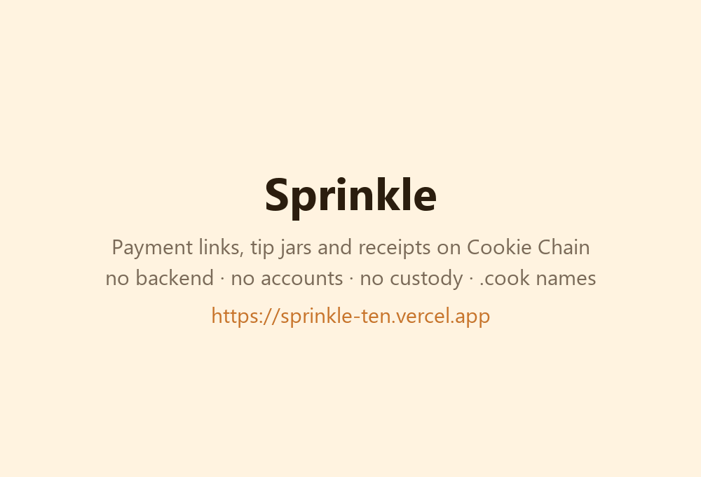

# Sprinkle 🍪

**Payment links, tip jars and a receipts dashboard on [Cookie Chain](https://www.cookiechain.wtf).**
No backend, no accounts, no custody. Everything runs in the browser against the community RPC.

Live: https://sprinkle-ten.vercel.app



## What it does

| Page | What happens on-chain |
| --- | --- |
| **Create link** (`/`) | Nothing yet. You pick recipient, token (COOK or any registry token), optional amount, label and message. The whole request is encoded in the URL, plus a QR code. Links never expire. |
| **Pay** (`/pay?…`) | Payer connects [Nightly](https://nightly.app), sees their balance, and sends. For COOK that is a `SystemProgram.transfer`; for SPL / Token‑2022 it is an idempotent ATA create + `transferChecked`. Every payment carries a `sprinkle:v1:<label>:<payer>` memo. The transaction is simulated first, signed by the wallet, broadcast by the page to `rpc.cookiescan.io`, and confirmed with live stage updates and an explorer link. |
| **Received** (`/dashboard`) | Reads `getSignaturesForAddress` + `getParsedTransactions` for any address or `.cook` name, extracts incoming COOK and token transfers, groups Sprinkle payments by label, shows totals (USD via Cookiescan prices), a per‑day chart and a table. Polls the newest signature every 10 s so new payments appear as they land. |
| **Receipt** (`/tx/<signature>`) | A shareable, self-verifying receipt. Opening it re-reads the transaction from the RPC: amount, token, from → to (with `.cook` primary names), label, time, slot, fee, status. Nothing is stored by Sprinkle, so a receipt cannot be edited after the fact. Linked from every successful payment and every dashboard row. |

## Pay with another token

If the payer does not hold enough of the requested token, the pay page offers to swap into it first through the **Candy Shop aggregator** (`swap.cookiescan.io`, routing across Cookieswap / Cookiebox liquidity). Sprinkle lists what the wallet does hold, finds the smallest input whose *guaranteed* output (after slippage) covers the shortfall, shows the route, aggregator fee and price impact, and then runs two wallet prompts: the swap, then the normal Sprinkle transfer with its memo. The aggregator only builds the swap transaction; the wallet signs it and the browser broadcasts it to the Cookie Chain RPC, exactly like a payment.

The aggregator sends no CORS headers, so `vercel.json` rewrites `/api/candyshop/*` to `https://swap.cookiescan.io/api/*` at the edge. It is a plain reverse proxy: no code, no keys, nothing stored. In `vite dev` the same path is proxied by the dev server.

## `.cook` names

Anywhere Sprinkle asks for a recipient you can type a [`.cook` name](https://book.cookoven.xyz) instead of an address. Links can carry the name itself (`/pay?to=alice.cook`), and the pay page resolves it on-chain at payment time — a single PDA read on the `cookie_domains` program — so a payment follows the name if it is ever transferred. Names sitting in the marketplace escrow are refused rather than paid into a program account. The dashboard shows a wallet's primary name via the reverse (`["primary", owner]`) record.

## Why sign-then-send instead of the wallet's `sendTransaction`

The Wallet Standard adapter maps any RPC it does not recognise to `solana:mainnet` and asks the
wallet to broadcast there. On a custom SVM network that is the wrong chain. Sprinkle asks the
wallet only to **sign**, then broadcasts the raw transaction itself to the Cookie Chain RPC, so the
flow is deterministic no matter which network the wallet UI has selected.

## Cookie Chain integrations

- RPC: `https://rpc.cookiescan.io` (HTTP only — the documented WS endpoint currently serves a mismatched TLS certificate, so confirmation and live updates are polled)
- Token registry + prices: `https://api.cookiescan.io/api/tokens`, `/api/price/cook`
- Swaps: Candy Shop aggregator `https://swap.cookiescan.io/api` (quote → build tx → sign in wallet → broadcast), via the edge rewrite in `vercel.json`
- Programs used: System, SPL Token, Token‑2022, Associated Token Account, Memo, Compute Budget, `cookie_domains` (`.cook` names, read-only), plus whatever DEX programs the aggregator routes through (Cookieswap CPAMM, Cookiebox DAMM/CLMM)
- Explorer links: https://cookiescan.io
- Bridge hint for empty wallets: https://hyperlane.cookiescan.io

## Security model

- **Nothing to approve, nothing to revoke.** A Sprinkle payment is a plain transfer. The app never asks for token delegates, program approvals, session keys or message signatures, so there is no standing permission a malicious link could exploit later.
- **You see the exact instructions before signing.** Every transaction is simulated against the Cookie Chain RPC first; simulation errors are turned into readable text and the wallet is never opened for a transaction that would fail.
- **Links cannot lie about where money goes.** The recipient is in the URL and shown on the pay page; `.cook` names are resolved from the on-chain registry at payment time, and names held by the marketplace escrow are refused instead of paid into a program account.
- **No backend, no custody, no accounts.** The site is static; the browser talks only to `rpc.cookiescan.io` and `api.cookiescan.io`. Nothing is stored server-side, so there is nothing to breach and nothing to phish out of a database.
- **Bounded inputs.** Labels are capped at 40 characters and stripped to printable ASCII before they go into the memo; messages are capped at 200 characters and never written on-chain.
- **Broadcast is explicit.** The wallet only signs; the page sends the raw transaction to the Cookie Chain RPC itself, so a wallet UI left on another network cannot route the transaction elsewhere.

## Run locally

```bash
npm install
npm run dev        # http://localhost:5173
npm run build      # static output in dist/
```

Deploys as a static site. `vercel.json` proxies `/api/candyshop/*` to the aggregator and rewrites every other route to `index.html`.

## Stack

Vite · React 19 · TypeScript · `@solana/web3.js` · `@solana/spl-token` · `@solana/wallet-adapter-*` · `qrcode`

## License

MIT
